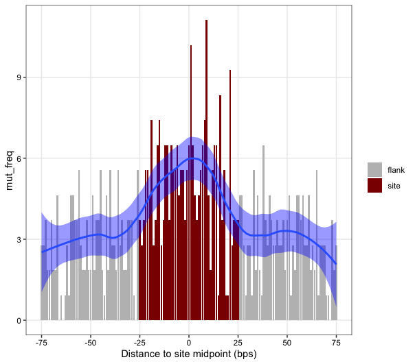

# Regression Models for Localised Mutations
Regression Models for Localised Mutations (RM2) is a tool for evaluating differential mutation rates and processes across classes of functional sites. RM2 uses negative binomial regression to assess whether sites of interest show an enrichment or depletion of mutations compared to flanking control regions of the same length. Further, RM2 was designed to test whether subclasses of mutations, like those of specific signatures, strandedness, transcription direction, and other features, show differential patterns. This allows for quick and systematic characterization of mutational processes and can be easily extended to site-based studies like pathway analysis.   

As input, RM2 requires:
1. Mutation file with optional annotation columns
2. Set of genomic regions containing the chr, start and end position of the sites

#### Publication - Lee, Abd-Rabbo, Reimand. Genome Biol (2021)
[Functional and genetic determinants of mutation rate variability in regulatory elements of cancer genomes](https://link.springer.com/article/10.1186/s13059-021-02318-x)

## Installation
#### devtools
Using the R package devtools, run: devtools::install_github('https://github.com/reimandlab/RM2')

#### From source
Clone the repository: https://github.com/reimandlab/RM2.git<br/>
Open R in the directory you cloned the package in and run install.packages("RM2", repos=NULL, type="source")

## Usage
**Required packages**<br/>
Biostrings<br/>
BSgenome<br/>
BSgenome.Hsapiens.UCSC.hg19<br/>
GenomeInfoDb<br/>
GenomicRanges<br/>
ggplot2<br/>
MASS<br/>
parallel<br/>
reshape2<br/>
S4Vectors

**Load the RM2 package**
```R
library(RM2)
```

**Load sites**
```R
data("ctcf_chr3_4")
head(ctcf_chr3_4, 2)
#    chr  start    end
# 1 chr4  29087  29584
# 2 chr4 236026 236407
```

**Load mutations**
```R
data("mutations_chr3_4")
head(mutations_chr3_4, 2)
#         chr     start       end ref alt
# 253901 chr4 128796154 128796154   G   T
# 253910 chr4 132966670 132966670   C   A
```

**Add mutation annotations**
```R
muts = cbind(mutations_chr3_4, get_mut_trinuc_strand(mutations_chr3_4))
head(muts, 2)
#         chr     start       end ref alt mut_trinuc mut_strand ref_alt
# 253901 chr4 128796154 128796154   G   T      ACA_A          c     C_A
# 253910 chr4 132966670 132966670   C   A      ACA_A          w     C_A
```

**Run regression for total mutations**
```R
window_size = 25
results = RM2(maf = muts,
              sites = ctcf_chr3_4,
              window_size = window_size)
results
#                 mut_type           pp this_coef obs_mut exp_mut exp_mut_lo exp_mut_hi       fc pp_cofac this_coef_cofac n_sites_tested
# 1 total_muts__total_muts 1.288732e-10 0.5575766     273     197        170    226.025 1.380711       NA              NA           7194
```

**Visualize results**
```R
n_patients = 150
dfr = get_mutations_in_flanked_sites(muts, ctcf_chr3_4, window_size, n_patients)
plot_mutations_in_flanked_sites(dfr, window_size)
```
<br/>


**Run regression with additional mutation subclasses**
```R
mut_class_columns = c(NA, "mut_strand", "ref_alt")
results = RM2(maf = muts,
              sites = ctcf_chr3_4,
              window_size = window_size,
              mut_class_columns = mut_class_columns)
```

**Run regression with mutation co-factor**
```R
muts$cofactor_col = sample(c(0,1), nrow(muts), replace=T)
results = RM2(maf = muts,
              sites = ctcf_chr3_4,
              window_size = window_size,
              cofactor_column = "cofactor_col")
```

**Run downsampled RM2**
```R
n_iterations = 10
n_sites_sampled = 5000
results = RM2_downsample(maf = muts,
                         sites = ctcf_chr3_4,
                         window_size = window_size,
                         n_sites_sampled = n_sites_sampled,
                         n_iterations = n_iterations)
```
